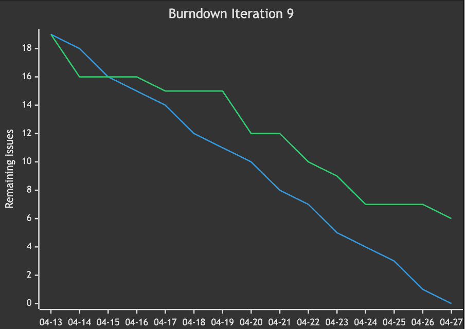

# copilot-agile-metrics

> Reusable GitHub Copilot prompt files for analysing GitHub Projects — works out-of-the-box in **VS Code Copilot Chat** and the **GitHub Web UI**.

---

## Prerequisites

| Requirement | Details |
|-------------|----------|
| **GitHub Copilot plan** | **Pro, Business, or Enterprise** required. The setup wizard (`setup.agent.md`) uses Agent mode to write files — this feature is not available on the Free plan. The five analysis prompts work on all plans that include Copilot Chat. |
| **VS Code extensions** | [GitHub Copilot](https://marketplace.visualstudio.com/items?itemName=GitHub.copilot) + [GitHub Copilot Chat](https://marketplace.visualstudio.com/items?itemName=GitHub.copilot-chat) |
| **GitHub repository** | Your issues must live in a GitHub repository (github.com). GitHub Enterprise Server is not supported. |
| **Agent mode** | Required for the setup wizard. In VS Code, select **Agent** in the mode dropdown at the bottom of the Copilot Chat panel. |

> **Not sure which plan you have?** Go to [github.com/settings/copilot](https://github.com/settings/copilot) and check your current subscription.

---

## 🚀 Getting Started — Run the Setup Wizard

The recommended first step is the **one-time setup wizard**. It asks about your project structure once and generates personalised, pre-configured versions of all five analysis prompts — ready to use with no further configuration.

| | |
|---|---|
| **Install in VS Code** |  |
| **Or download manually** |  → place in `.github/prompts/` of your project |

**After installing:**
1. Open your project in VS Code and open Copilot Chat (`⌃⌘I` / `Ctrl+Alt+I`)
2. Click the **Agent ∨** dropdown at the bottom of the chat panel and select **Agent** mode
3. Select the prompt **"Setup — Generate Configured Prompts"** from the picker
4. Send any message (e.g. `start`) — the wizard will ask you 10 short questions and generate your personalised prompts

> **VS Code only.** The setup wizard writes files to your project, which requires Agent mode. It does not work in the GitHub Web UI.

---

## Available Analysis Prompts

After running the setup wizard, use these prompts by typing `/` in the Copilot Chat prompt picker — e.g. `/sprint-analysis`. The generated versions in `.github/prompts/` are pre-configured for your project and require no further input.

The **Raw** links let you download the generic (unconfigured) version of each prompt — useful if you want to copy it directly into your own `.github/prompts/` file and customise it by hand, or if you want to use a prompt without running the setup wizard first.

| Prompt (after setup) | Raw | Description |
|----------------------------|-----|-------------|
| [/sprint-analysis](prompts/sprint-analysis.prompt.md) |  | Analyse the current sprint — open issues, at-risk items, blockers, workload by assignee |
| [/retro-input](prompts/retro-input.prompt.md) |  | Generate retrospective input from the last sprint — label patterns, discussion load, communication gaps |
| [/throughput-forecast](prompts/throughput-forecast.prompt.md) |  | Throughput-based probabilistic forecast — when will the remaining issues be done? Three scenarios (optimistic / realistic / pessimistic) based on historical throughput percentiles. |
| [/burndown-chart](prompts/burndown-chart.prompt.md) |  | Mermaid burndown chart for the current sprint based on issue close dates |
| [/stakeholder-update](prompts/stakeholder-update.prompt.md) |  | Management-ready sprint update: executive summary + risk table, generated in seconds |

> **Using the GitHub Web UI instead?** Open any `.prompt.md` file in this repository on github.com and click the **Copilot icon** in the file toolbar ("Open in Copilot"). The five analysis prompts work in both VS Code and the GitHub Web UI. The setup wizard only works in VS Code Agent mode.
>
> **Ask mode fallback:** If Copilot doesn't have access to your repository data, type `@github` at the start of your message before invoking the prompt.

---

## Example Output

📋 Sprint Analysis — example

### 🏃 Sprint: Sprint 42 — Analysis as of 2026-04-26

#### 🚫 Blockers (1)

| # | Title | Labels | Assignee | Reason |
|---|-------|--------|----------|--------|
| #87 | Auth service times out under load | `blocked`, `backend` | @alice | `blocked` label |

#### ⚠️ Ownership Gaps — Issues with no assignee (1)

| # | Title | Age (days) | Labels |
|---|-------|-----------|--------|
| #84 | Update API docs | 7 | `docs` |

#### ⚠️ At Risk — Open for more than 5 days (3)

| # | Title | Age (days) | Assignee | Labels |
|---|-------|-----------|----------|--------|
| #91 | Migrate DB schema | 9 | @bob | `backend` |
| #84 | Update API docs | 7 | *(unassigned)* | `docs` |
| #79 | Fix flaky E2E tests | 6 | @alice | `testing` |

#### 👤 Workload by Assignee

| Assignee | Open Issues | At Risk | Blockers |
|----------|------------|---------|----------|
| @alice | 4 | 2 | 1 |
| @bob | 3 | 1 | 0 |
| *(unassigned)* | 1 | 1 | 0 |

#### 🔑 Key Findings

- 1 of 8 open issues carries a `blocked` label — the auth timeout needs immediate triage.
- @alice owns 4 of 8 issues, 2 of which are flagged at risk or blocked.
- 2 issues have no assignee, including one already 7 days old.

#### 💡 Recommendations for the Scrum Master

- **Follow up with @alice** on #87 — a blocker on the auth service affects all downstream work.
- **Assign #84** before end of day; unassigned issues at day 7 rarely close by sprint end.
- **Discuss at stand-up** whether #91 can be descoped or split to keep the sprint on track.

📈 Burndown Chart — example

*Blue line: ideal burndown. Green line: actual remaining issues. Generated by the `/burndown-chart` prompt using issue `closedAt` dates.*

---

## Limitations

GitHub Copilot reads the **current state** of issues and projects via the GitHub API. It does **not** have access to historical status-change events — meaning it cannot determine when an issue moved from *"In Progress"* to *"Done"* or how long it spent in a particular workflow column.

> **GitHub Projects v2 — important caveat:** Custom fields (e.g. a "Sprint" select field) and Iteration fields are only accessible via the GraphQL API, which GitHub Copilot does not use by default. This means sprint boundaries and custom field values **cannot be read automatically** in most setups.
>
> **Recommendation:** For reliable sprint filtering, use **Milestones** (one per sprint, with a due date) or **Labels** (e.g. `sprint-42`). Both work with the standard REST API and require no additional configuration. If you use Projects v2 Iterations, the prompts will attempt to read the dates via GraphQL and ask you to provide them manually as a fallback.

As a result, the following metrics **cannot be computed** by these prompts:

| Metric | Why it's unavailable |
|--------|----------------------|
| **Cycle Time** | Requires knowing when work *started* on an issue — the first transition into an active state (e.g. "In Progress"), which is not exposed via the API Copilot uses |
| **Time-in-State** | Requires a full history of every status transition with timestamps |
| **Multi-sprint trends** | Require aggregated historical data across many sprints |

What these prompts **can** do:

- Read all open/closed issues and their metadata (labels, assignees, milestones, comments, `closedAt` date)
- Calculate **Elapsed Time per issue** as `closedAt − createdAt` (creation to close). This is a rough proxy — not Lead Time or Cycle Time in the flow-metrics sense, because it includes time before work actually started.
- Estimate **throughput** (issues closed per week) from `closedAt` dates
- Generate simple forecasts, burndowns, and summaries based on throughput
- Identify structural risk signals (no assignee, blocker labels, proximity to deadline)

For automatically tracked Cycle Time, Time-in-State distributions, and real Monte Carlo simulations visit **[flow2c.com](https://flow2c.com?utm_source=copilot-agile-metrics)**.

---

## Take It Further — flow2c.com

These prompts surface insights from GitHub's current issue state — no extra tooling required. For automatically tracked, historically accurate flow metrics, the team behind this project builds **[flow2c.com](https://flow2c.com?utm_source=copilot-agile-metrics)**.

| | Free prompts | flow2c.com |
|---|:---:|:---:|
| Sprint health snapshot | ✅ | ✅ |
| Burndown chart | ✅ | ✅ |
| Throughput forecast | ✅ | ✅ |
| Stakeholder update | ✅ | ✅ |
| Retrospective input | ✅ | ✅ |
| **Cycle Time distribution** | ❌ | ✅ |
| **Time-in-State analysis** | ❌ | ✅ |
| **Real Monte Carlo simulation** | ❌ | ✅ |
| **Multi-sprint trend charts** | ❌ | ✅ |
| **Automatic daily refresh** | ❌ | ✅ |

[**→ Start for free at flow2c.com**](https://flow2c.com?utm_source=copilot-agile-metrics)

---

## Contributing

Contributions are welcome! See [CONTRIBUTING.md](CONTRIBUTING.md) for the full guide.

Quick summary:

1. Fork the repository and create a feature branch.
2. Follow the existing prompt structure: YAML frontmatter (`name` + `description`) and a `## Before You Begin` section that asks for required parameters interactively.
3. Add your prompt to the table in this README.
4. Open a pull request with a short description of what the prompt does and what GitHub data it requires.

Please keep prompts language-agnostic (English), self-contained, and honest about what Copilot can and cannot compute.

See also: [Code of Conduct](CODE_OF_CONDUCT.md) · [Security Policy](SECURITY.md)

---

*Built and maintained by the team behind [flow2c](https://flow2c.com?utm_source=copilot-agile-metrics) – automated flow metrics for GitHub Projects.*
